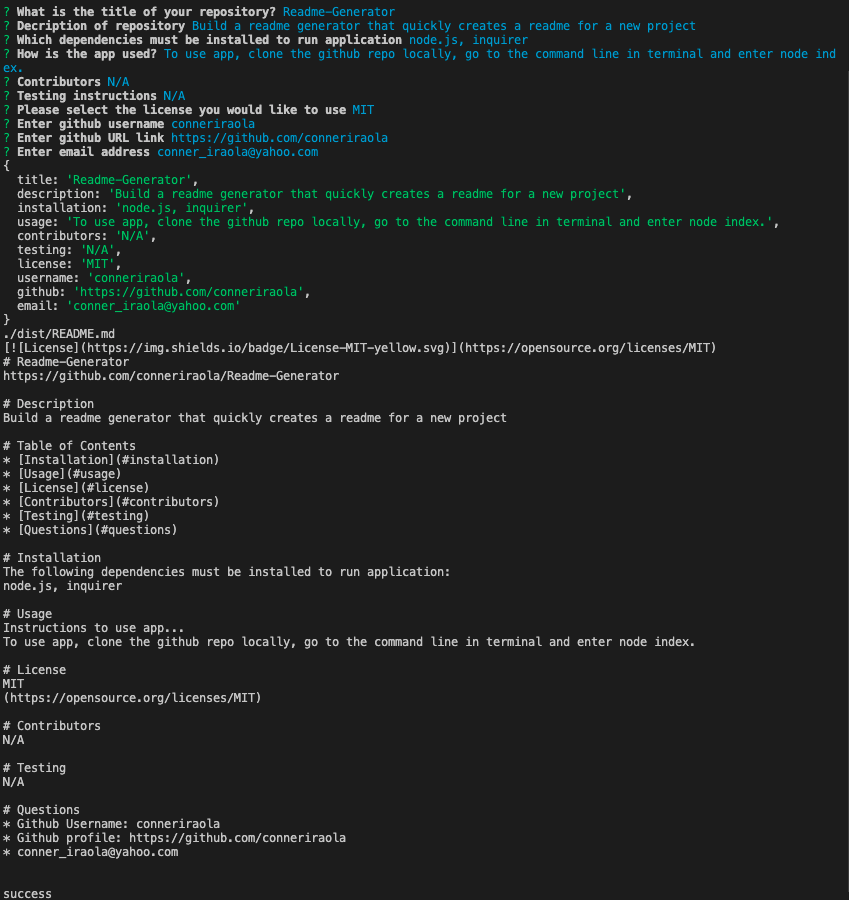

# Readme-generator
https://github.com/conneriraola/Readme-generator

# Description
Build a readme generator that quickly creates a readme for a new project

# Table of Contents
* [Installation](#installation)
* [Usage](#usage)
* [License](#license)
* [Contributors](#contributors)
* [Testing](#testing)
* [Questions](#questions)

# Screenshot: 

    

# Installation 
The following dependencies must be installed to run application: 
node.js, inquirer

# Usage
Instructions to use app... 
To use app, clone the github repo locally, go to the command line in terminal and enter node index.

# License
MIT
[(https://opensource.org/licenses/MIT)

# Contributors
N/A

# Testing
N/A

# Questions
* Git Hub Username: conneriraola
* Github profile: https://github.com/conneriraola
* conner_iraola@yahoo.com
